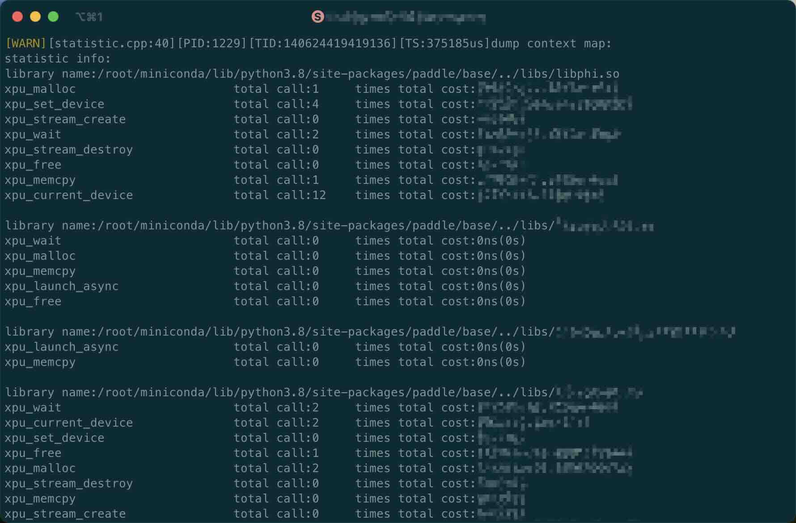
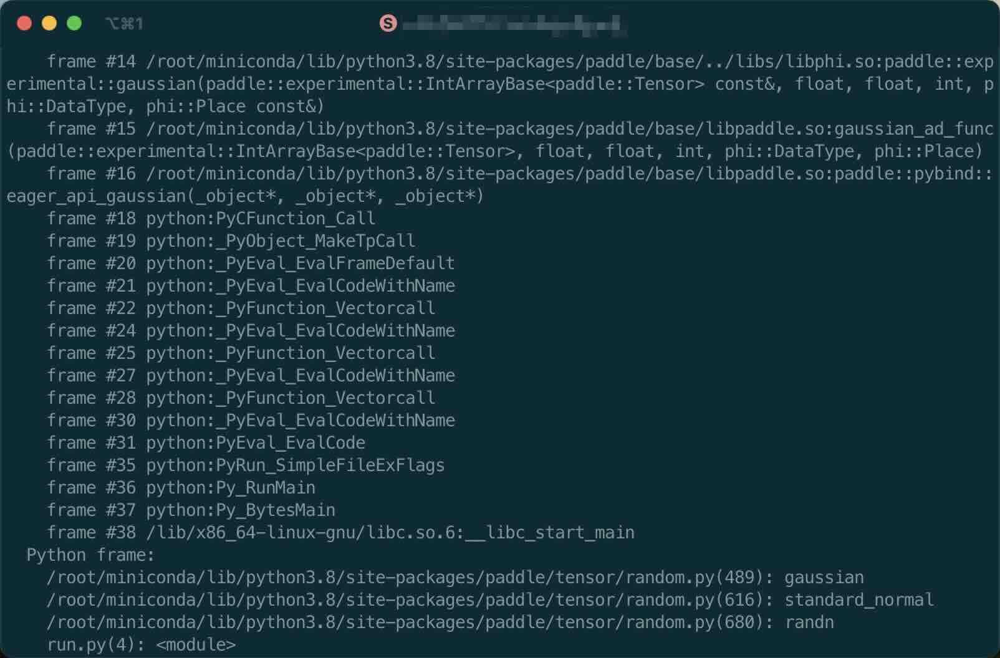
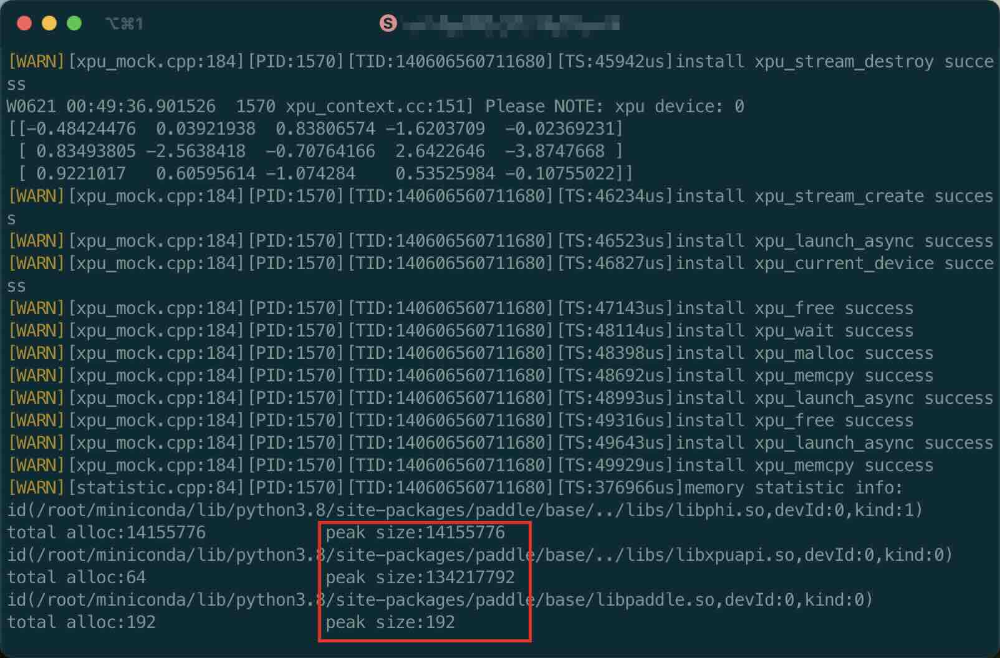
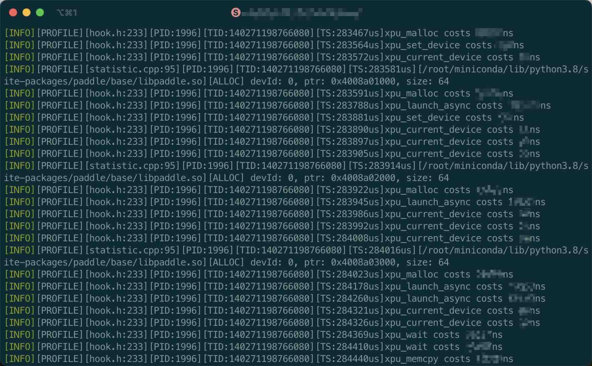
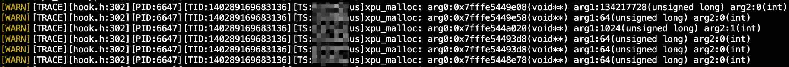

# cuda-rt-hook(cuda_mock)

[](https://pypi.python.org/pypi/cuda_mock)

cuda-rt-hook（cuda_mock）是一个用于拦截CUDA/XPU Runtime接口(例如，`cudaMalloc`和`xpu_malloc`)调用的Python库，通过修改PLT(Procedure Linkage Table)来实现动态拦截，无需重新编译PyTorch、Paddle等复杂框架，安装后即可使用，在调用堆栈追踪、调用耗时统计以及Paddle/PyTorch训练和推理的精度调试和性能优化等场景下非常有用。

本项目的灵感来自于[plthook](https://github.com/kubo/plthook)项目，项目的初衷是通过拦截CUDA的Runtime调用转为调用mock函数，可以在没有CUDA和GPU环境的情况下运行和调试[triton](https://github.com/triton-lang/triton)等项目，因而项目取名cuda_mock。后续增加了多个功能，使得cuda_mock项目可以用于模型的调试和性能分析。

## 安装

### 直接安装(建议)
```bash
pip install cuda_mock
```

### 从源码构建
```bash
git clone --recursive https://github.com/lipracer/cuda-rt-hook
cd cuda-rt-hook

python setup.py sdist bdist_wheel
pip install dist/*.whl

# 或者:
# python setup.py install
```

## 快速开始

找到Paddle/PyTorch模型的训练/推理脚本入口，在首次`import torch`/`import paddle`之后添加如下代码:

```python
import paddle
import cuda_mock; cuda_mock.xpu_initialize() # 加入这一行
```
或者
```python
import torch
import cuda_mock; cuda_mock.xpu_initialize() # 加入这一行
```

根据实际的需求和场景设置cuda_mock的功能环境变量(参考[功能使用演示章节](#功能使用演示))，接着按照训练/推理脚本原有的执行方式运行脚本即可。


## 功能使用演示

### 功能1: 统计各个so库调用Runtime接口的次数和总耗时

```bash
LOG_LEVEL=WARN python run.py
```

在程序运行结束之后会显示:




### 功能2: 打印`xpu_wait`的C++、C和Python调用堆栈

```bash
HOOK_ENABLE_TRACE="xpu_wait=1" python run.py
```

在程序运行结束之后会显示:



### 功能3: 统计模型训练/推理过程中的峰值内存

```bash
LOG_LEVEL=WARN python run.py
```

在程序运行结束之后会显示:



### 功能4: 打印Runtime接口的耗时

```bash 
LOG_SYNC_MODE=1 LOG_LEVEL=PROFILE=INFO python run.py
```

在程序运行过程中会显示:



### 功能5：打印Runtime的参数

```bash
HOOK_ENABLE_TRACE=xpu_malloc=0b10 python run.py
HOOK_ENABLE_TRACE=xpu_malloc=0x2 python run.py
```

在程序运行过程中会显示:



### 功能6: 收集CUDA算子调用堆栈
- 找到nvcc安装路径
`which nvcc`  
- 用我们的nvcc替换系统的nvcc（我们只是在编译选项加了`-g`）  
`mv /usr/local/bin/nvcc /usr/local/bin/nvcc_b`  
`chmod 777 tools/nvcc`  
`cp tools/nvcc /usr/local/bin/nvcc`
- 构建并且安装pytorch
- 构建并且安装cuda_mock
- 注意要在import torch之后import cuda_mock
- 开始跑你的训练脚本
- 我们将会把堆栈打印到控制台

## 环境变量

| 环境变量 | 默认值 | 简短说明 |
| - | - | - |
| LOG_LEVEL         | WARN                            | 设置全局和各个日志模块的日志级别  |
| HOOK_ENABLE_TRACE | 全部接口默认值为0（关闭backtrace）  | 是否开启backtrace或参数打印     |
| LOG_OUTPUT_PATH   | ""                              | 是否将日志重定向到文件          |
| LOG_SYNC_MODE     | 0                               | 是否使用同步日志输出            |

### LOG_LEVEL
- **用法示例**: `export LOG_LEVEL=WARN,TRACE=INFO`
- **可选值**: 
  - 日志级别: INFO, WARN, ERROR, FATAL
  - 日志模块: PROFILE, TRACE, HOOK, PYTHON
- **默认值**: 
  - 全局日志级别: WARN
  - 各个日志模块的默认日志级别: WARN
- **说明**: 设置全局和各个日志模块的日志级别

### HOOK_ENABLE_TRACE
- **用法示例**: `export HOOK_ENABLE_TRACE='xpu_memcpy=1,xpu_set_device=0,xpu_wait=0x1'`
- **可选值**: xpu_malloc, xpu_free, xpu_wait, xpu_memcpy, xpu_set_device, xpu_current_device, xpu_launch_async
- **默认值**: 所有接口的默认值均为0，即所有接口默认关闭backtrace
- **说明**: 是否开启backtrace和参数打印

`HOOK_ENABLE_TRACE`可接收十进制、二进制和十六进制的数字，不同的位作为不同的开关

| Bit | 开关说明 |
| - | - |
| 0 | 是否开启backtrace |
| 1 | 是否开启参数打印 |

### LOG_OUTPUT_PATH
- **用法示例**: `export LOG_OUTPUT_PATH='/tmp/'`
- **可选值**: 日志输出文件夹
- **默认值**: ""
- **说明**: 是否将日志重定向到文件, 默认是输出到标准输出

### LOG_SYNC_MODE
- **用法示例**: `export LOG_SYNC_MODE=1`
- **可选值**: 0 或 1
- **默认值**: 0
- **说明**: 是否使用同步日志输出，同步日志输出可能会影响主线程的执行时间，但可以使CUDA_MOCK输出的日志与其它日志系统输出保序

## 高级功能

### 实现自定义hook函数  
实现自定义hook installer例子:

```python
class PythonHookInstaller(cuda_mock.HookInstaller):
    def is_target_lib(self, name):
        return name.find("libcuda_mock_impl.so") != -1
    def is_target_symbol(self, name):
        return name.find("malloc") != -1
lib = cuda_mock.dynamic_obj(cpp_code, True).appen_compile_opts('-g').compile().get_lib()
installer = PythonHookInstaller(lib)
```

- 实现hook回调接口 `PythonHookInstaller`  
- 构造函数需要传入自定义hook函数的库路径（绝对路径 并且 传入库中必须存在与要替换的函数名字以及类型一致的函数 在hook发生过程中，将会把原函数的地址写入以`__origin_`为开头目标`symbol`接口的变量中，方便用户拿到原始函数地址 参考:`test/py_test/test_import_mock.py:15`处定义）
- `is_target_lib` 是否是要hook的目标函数被调用的library
- `is_target_symbol` 是否是要hook的目标函数名字（上面接口返回True才回调到这个接口）
- `new_symbol_name` 构造函数中传入共享库中的新的用于替换的函数名字，参数`name`：当前准备替换的函数名字
- `dynamic_obj` 可以运行时编译c++ code，支持引用所有模块：`logger`、`statistics`

## 贡献代码

### 调试编译

```bash
# 编译
cmake -S . -B build -DCMAKE_INSTALL_PREFIX=`$pwd/`build -DENABLE_BUILD_WITH_GTEST=ON -GNinja
cmake --build build

# 运行单测
cd build
ctest -R
```
